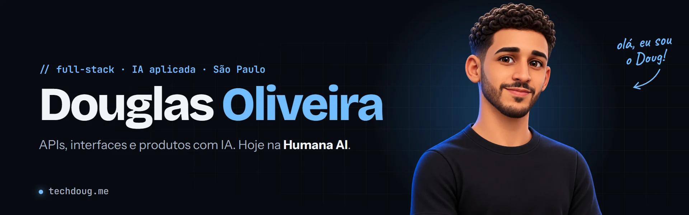
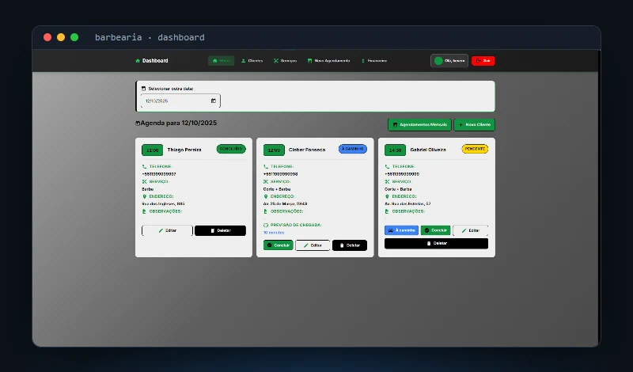
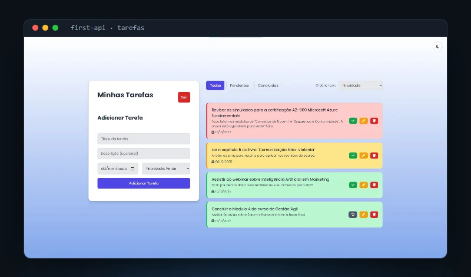
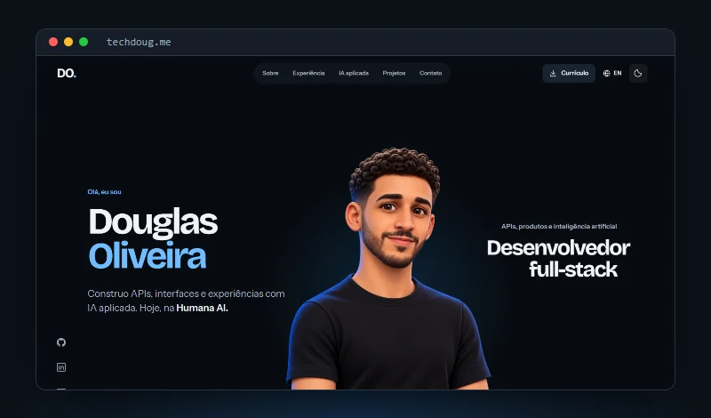

<a href="https://www.techdoug.me/">
  <picture>
    <source media="(prefers-color-scheme: light)" srcset="assets/banner-light.webp">
    
  </picture>
</a>

  
  
  
  

  

### Sobre mim

- Hoje na **[Humana AI](https://www.techdoug.me/#experiencia)**: integro LLMs, agentes, ferramentas e respostas em streaming a uma plataforma web, com React/TypeScript, Node.js/Next.js e PostgreSQL.
- Gosto de levar uma ideia do começo ao fim: API, dados, interface, testes (Vitest, Playwright, Pytest) e deploy.
- Tecnólogo em Análise e Desenvolvimento de Sistemas (FAM) e aluno do Oracle Next Education.
- Fora do código, campeão brasileiro de **Ultimate Frisbee**.

### Projetos em destaque

<table>
  <tr>
    <td width="33%" valign="top">
      
       <b><a href="https://github.com/notdougz/projeto-barbearia">Sistema de agendamentos</a></b>
       Cliente real · agenda, financeiro e SMS · <b>250 testes</b> e CI/CD
       <code>Django</code> <code>PostgreSQL</code> <code>Railway</code>
    </td>
    <td width="33%" valign="top">
      
       <b><a href="https://github.com/notdougz/first-api">First API</a></b>
       API assíncrona com JWT, tarefas isoladas por usuário e testes
       <code>FastAPI</code> <code>SQLAlchemy</code> <code>Docker</code>
    </td>
    <td width="33%" valign="top">
      
       <b><a href="https://github.com/notdougz/portfolio">techdoug.me</a></b>
       Portfólio bilíngue com animações de scroll e currículo
       <code>Vite</code> <code>GSAP</code> <code>JavaScript</code>
    </td>
  </tr>
</table>

### Stack

   
   
  

### Trajetória

- **2026 — hoje** · Desenvolvedor Full-Stack na **Humana AI** — plataforma de IA, LLMs, agentes e streaming
- **2025 — 2026** · Desenvolvedor Full-Stack na **Appen Seguros** — automação em Python, APIs Node.js/AdonisJS, React
- **2025** · Desenvolvedor Full-Stack **autônomo** — sistema de gestão para barbearia, do código ao deploy

Antes do desenvolvimento

Rotinas administrativas hospitalares no **Hospital e Maternidade Santa Joana** e na **Pro Matre Paulista**, e jovem aprendiz na **Santa Rita Industrial e Comercial**. Essa experiência continua no meu jeito de ouvir, organizar e resolver problemas.

---

  <b>Vamos conversar?</b> Full-stack, back-end ou IA aplicada:
  <a href="mailto:doug.dev@hotmail.com">doug.dev@hotmail.com</a> ·
  <a href="https://www.linkedin.com/in/douglas-oliveira-627088188/">LinkedIn</a> ·
  <a href="https://www.techdoug.me/">techdoug.me</a>

